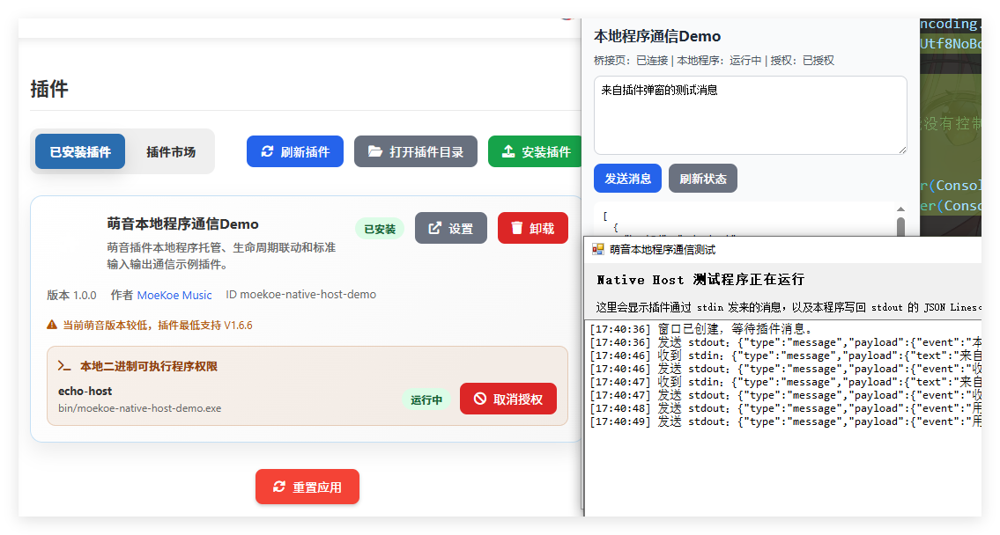

# 萌音本地程序通信示例插件

这个插件用于演示 MoeKoe Music 插件如何通过受控的 Native Host 机制启动插件自带的本地程序，并使用标准输入/标准输出进行私有通信。

适用场景包括任务栏歌词、系统托盘辅助窗口、硬件控制、本地配置同步等需要插件配合本地进程完成的功能。
歌曲、歌词、播放状态等主程序已有能力不建议放进这条私有通道。

## 目录结构

```text
moekoe-native-host-demo/
├─ manifest.json
├─ background.js
├─ native-bridge.html
├─ native-bridge.js
├─ popup.html
├─ popup.js
├─ popup.css
└─ bin/
   ├─ moekoe-native-host-demo.exe
   └─ native-host-demo.cs
```

关键文件说明：

- `manifest.json`：声明插件权限、本地程序、平台路径和 bridge 页面。
- `native-bridge.html` / `native-bridge.js`：隐藏桥接页，负责连接 Electron Main Process 和插件 background。
- `background.js`：插件后台脚本，维护长期状态并转发 popup 的请求。
- `popup.html` / `popup.js`：示例界面，不直接持有 native host 长连接。
- `bin/moekoe-native-host-demo.exe`：Windows 示例本地程序，并通过 stdin/stdout 收发 JSON Lines。

## manifest 声明

Native Host 插件必须声明 `moekoe:nativeHost` 权限，并在 `moekoe_native_hosts` 中声明本地程序。

```json
{
  "permissions": ["storage"],
  "moekoe_permissions": ["moekoe:nativeHost"],
  "moekoe_native_hosts": [
    {
      "id": "echo-host",
      "platforms": {
        "win32": {
          "path": "bin/moekoe-native-host-demo.exe",
          "args": []
        },
        "darwin": {
          "path": "bin/moekoe-native-host-demo",
          "args": []
        },
        "linux": {
          "path": "bin/moekoe-native-host-demo",
          "args": []
        }
      },
      "auto_start": true,
      "bridge": "native-bridge.html"
    }
  ]
}
```

字段说明：

- `moekoe_permissions`：MoeKoe Music 专用权限声明，`moekoe:nativeHost` 表示插件请求本地程序托管能力。
- `moekoe_native_hosts`：插件声明的本地程序列表。
- `id`：本地程序 ID，插件发送消息时使用。
- `platforms`：按平台声明对应的可执行程序。支持 `win32`、`darwin`、`linux`。
- `path`：本地程序路径，必须是插件目录内的相对路径，不能是绝对路径，不能包含 `..`。
- `args`：启动参数，只能是字符串数组。主程序使用 `spawn(file, args)` 启动，不经过 shell 拼接。
- `auto_start`：授权后是否随应用启动自动启动本地程序。
- `bridge`：隐藏桥接页路径，必须位于插件目录内。

Windows 平台的 `path` 必须以 `.exe` 结尾。macOS 和 Linux 需要提供对应平台可执行文件，并确保发布包中保留可执行权限。

本地程序是否显示窗口由 可执行程序 自己决定。需要界面时就在内创建窗口；不需要界面时应编译为无控制台窗口的后台程序，或启动后不创建可见窗口。

## 授权与启动时机

用户必须在插件管理页手动授权本地程序。未授权时，本地程序不会启动，插件调用 native host API 会失败。

`auto_start: true` 时，本地程序会在以下条件同时满足时自动启动：

- 插件已经加载成功；
- 用户已经授权；
- manifest 校验通过；
- 当前平台有对应的 `platforms` 配置；
- 应用启动、插件重新加载或插件索引同步完成。

`auto_start: false` 时，应用启动不会自动拉起本地程序。
插件第一次调用 `nativeHost.send()` 发送消息时，Main Process 会按需启动本地程序，即 “懒启动”。

取消授权、卸载插件、重载插件或退出应用时，Main Process 会先向本地程序写入：

```json
{"type":"shutdown"}
```

本地程序应收到后主动退出。超时未退出时，主程序会强制结束进程树。

## 通信链路

推荐链路如下：

```text
popup
  -> chrome.runtime.sendMessage
background
  -> chrome.runtime.Port
native-bridge
  -> window.electronAPI.nativeHost
Electron Main Process
  -> stdin/stdout
native exe
```

popup 不建议直接持有长期连接。popup 关闭后页面会销毁，状态应放在 background 中维护。

bridge 页面由 Main Process 在授权后隐藏打开。它同时具备两个能力：

- 运行在 `chrome-extension://` 上下文，可以使用 `chrome.runtime.connect()` 连接 background；
- 带有 Electron preload，可以使用 `window.electronAPI.nativeHost` 调用 Main Process。

## bridge 写法

bridge 负责把 background 的请求转发给 Main Process，并把 native exe 的输出事件转回 background。

```js
const HOST_ID = "echo-host";
const port = chrome.runtime.connect({ name: "moekoe-native-host-bridge" });

window.electronAPI.nativeHost.onMessage((payload) => {
  if (payload?.hostId !== HOST_ID) {
    return;
  }

  port.postMessage({
    type: "native-host:event",
    payload
  });
});

port.onMessage.addListener(async (message) => {
  if (message.type === "native-host:status") {
    const result = await window.electronAPI.nativeHost.getStatus(HOST_ID);
    port.postMessage({
      type: "native-host:response",
      requestId: message.requestId,
      result
    });
    return;
  }

  if (message.type === "native-host:send") {
    const result = await window.electronAPI.nativeHost.send(HOST_ID, message.payload);
    port.postMessage({
      type: "native-host:response",
      requestId: message.requestId,
      result
    });
  }
});
```

## background 写法

background 负责保存 bridge 连接、记录本地程序状态，并响应 popup 请求。

```js
let bridgePort = null;
let requestId = 0;
const pending = new Map();

chrome.runtime.onConnect.addListener((port) => {
  if (port.name !== "moekoe-native-host-bridge") {
    return;
  }

  bridgePort = port;

  port.onMessage.addListener((message) => {
    if (message?.type === "native-host:response") {
      const resolve = pending.get(message.requestId);
      if (resolve) {
        pending.delete(message.requestId);
        resolve(message.result);
      }
    }
  });
});

function sendBridgeRequest(type, payload) {
  if (!bridgePort) {
    return Promise.reject(new Error("本地程序尚未授权或桥接页未连接"));
  }

  const id = ++requestId;
  bridgePort.postMessage({ type, payload, requestId: id });

  return new Promise((resolve) => {
    pending.set(id, resolve);
  });
}
```

popup 可以通过 `chrome.runtime.sendMessage()` 请求 background 查询状态或发送消息。

## stdin/stdout 协议

Main Process 与本地程序之间使用 UTF-8 JSON Lines。每条消息必须是一行完整 JSON，末尾带换行。

插件发给本地程序时，本地程序 stdin 收到：

```json
{"type":"message","payload":{"action":"set-config","data":{}}}
```

本地程序发给插件时，向 stdout 写入：

```json
{"type":"message","payload":{"event":"ready","data":{}}}
```

主程序关闭本地程序时，向 stdin 写入：

```json
{"type":"shutdown"}
```

本地程序应只把协议消息写入 stdout。调试日志建议写 stderr，Main Process 会把 stderr 作为日志记录，不会转发给插件。

## 本地程序开发要点

本地程序需要做到：

- 从 stdin 按行读取 UTF-8 文本；
- 每行解析为 JSON；
- 收到 `type: "shutdown"` 时尽快清理资源并退出；
- 向 stdout 写出一行 JSON 后立即 flush；
- 不要输出超大消息，单条消息建议小于 64KB；
- 普通日志写 stderr，不要混入 stdout。

这个示例插件的 C# 示例位于 `bin/native-host-demo.cs`。它是一个 WinForms 窗口程序，窗口中会显示收到的 stdin 消息和写回 stdout 的 JSON Lines。重新编译 Windows exe 可使用：

```powershell
& 'C:\Windows\Microsoft.NET\Framework64\v4.0.30319\csc.exe' `
  /nologo `
  /codepage:65001 `
  /target:winexe `
  /reference:System.Windows.Forms.dll `
  /reference:System.Drawing.dll `
  /out:plugins\extensions\moekoe-native-host-demo\bin\moekoe-native-host-demo.exe `
  plugins\extensions\moekoe-native-host-demo\bin\native-host-demo.cs
```

## 安全限制

Native Host 能力受以下限制保护：

- 插件必须声明 `moekoe:nativeHost`。
- 用户必须在插件管理页授权。
- 插件只能访问自己声明的 host，不能访问其他插件的 host。
- 可执行文件路径必须在插件目录内。
- Windows 只能声明 `.exe`。
- `args` 不经过 shell，不能通过字符串拼接执行命令。
- 未授权、声明无效、平台不支持时，API 会返回失败。

## 调试步骤

1. 将插件放在 `plugins/extensions/moekoe-native-host-demo`。
2. 启动 MoeKoe Music。
3. 打开插件管理页，找到本插件。
4. 点击本地程序授权。
5. 打开插件 popup，点击查询状态或发送示例消息。
6. 如果收不到响应，先确认 bridge 是否已连接，再查看主程序日志中的 native host 错误。

常见问题：

- `当前平台不支持该本地程序`：manifest 中没有当前平台配置。
- `本地程序文件不存在`：`platforms.<platform>.path` 指向的文件不存在。
- `本地程序尚未授权`：用户还没有在插件管理页授权。
- 收到无效 JSON 日志：本地程序 stdout 输出了非 JSON Lines 内容。


